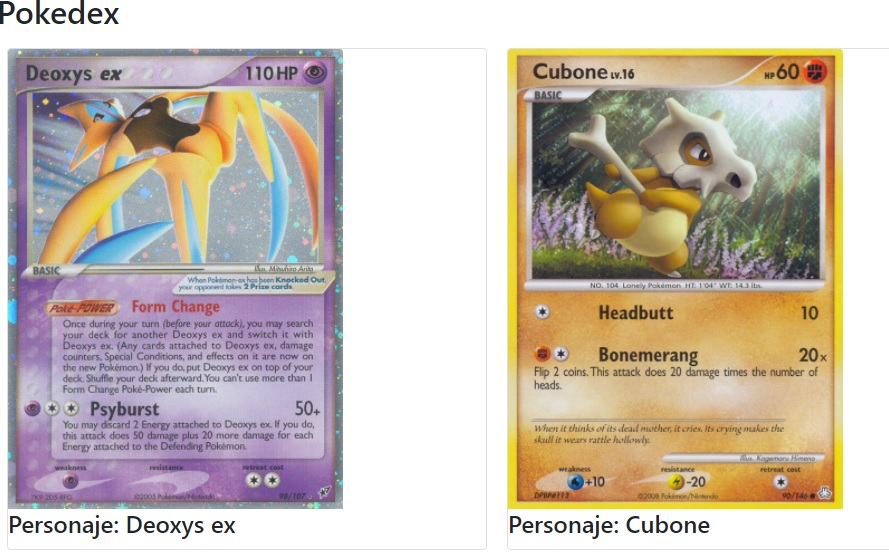

# POKEDEX
***

## Flujo de trabajo: 

1. Desarrollar una web consumiendo la api de pokemon, presentando su imagen y nombre.

## Objetivo

El usuario podrá conocer los distintos tipos de Pokemones con nombre e imagen.

 

